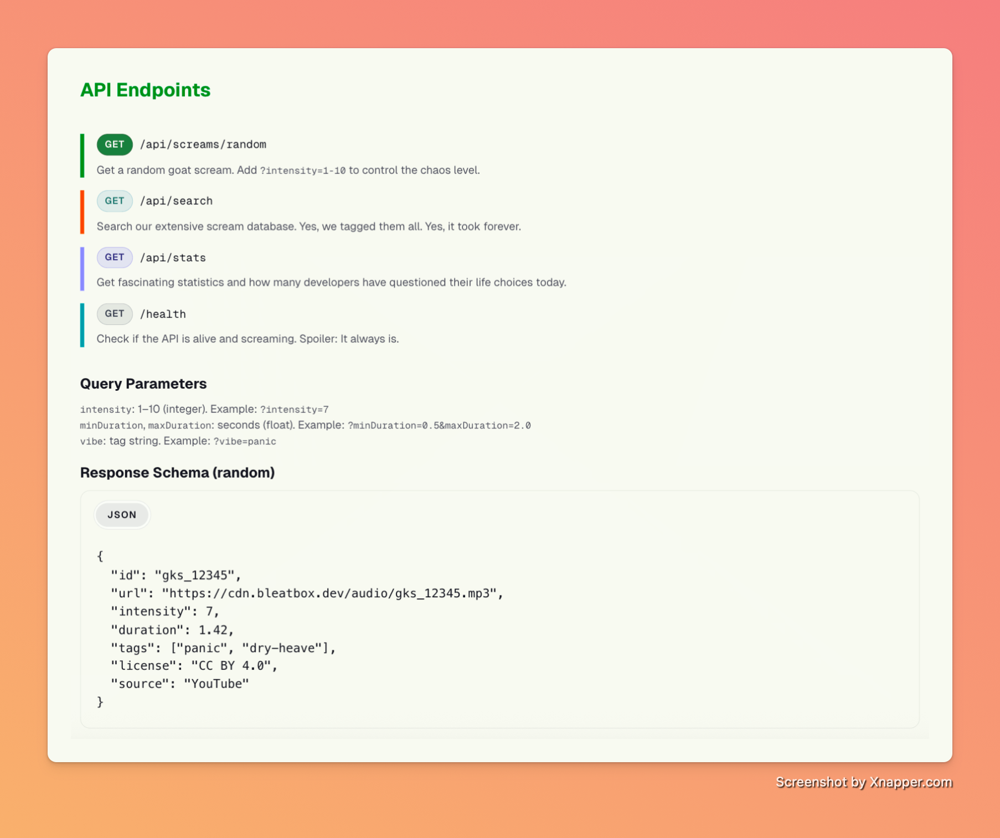

# Goat Screams API

> An educational, copy‑pasteable goat scream API for demos, keyboards, and internet mischief.

[](https://github.com/AIMateyApps/goat-scream-api/actions/workflows/ci.yml)
[](coverage)
[](https://codespaces.new/AIMateyApps/goat-scream-api)
[](LICENSE)

This is a **teaching repository** demonstrating how a production-ready Express.js API is wired: graceful shutdowns, health checks, caching, circuit breakers, and observability—while delivering sheer goat-powered delight.

**Landing page & interactive playground**: [goatscreams.com/goat-scream-api](https://goatscreams.com/goat-scream-api)

## Table of contents

- [Requirements & compatibility](#requirements--compatibility)
- [Quick Start](#quick-start)
- [Key features](#key-features)
- [TypeScript SDK](#typescript-sdk)
- [Screenshots](#screenshots)
- [Working with the JSON Snapshot](#working-with-the-json-snapshot)
- [Architecture Overview](#architecture-overview)
- [Deploy in Minutes](#deploy-in-minutes)
- [CI & Health checks](#ci--health-checks)
- [Optional: Advanced API Setup](#optional-advanced-api-setup)
- [Configuration](#configuration)
- [Example PRDs](#example-prds-for-upcoming-examples)
- [Teaching & Remix Ideas](#teaching--remix-ideas)
- [Roadmap & Status](#roadmap--status)
- [Troubleshooting & FAQ](#troubleshooting--faq)
- [Community](#community)
- [Maintainers](#maintainers)
- [Versioning & releases](#versioning--releases)
- [Disclaimer & Credits](#disclaimer--credits)

## Requirements & compatibility

- Node.js 20.x (tested on macOS Sonoma + Ubuntu 22.04)
- pnpm >= 8 (install via `npm i -g pnpm`)
- Optional: MongoDB 7.x and Redis 7.x for the advanced API paths
- Prefer cloud dev? Use the Codespaces badge above or the included `.devcontainer` setup for a one-click environment.

Verify your toolchain:

```bash
node -v && pnpm -v
```

Look for the `Goat Screams API running on port 3000` log line when the dev server boots.

## Quick Start

```bash
pnpm install
pnpm run dev   # http://localhost:3000 (uses the committed static snapshot)
```

### Testing

Run `pnpm test` to execute the full Jest suite. CI enforces 75% thresholds for statements, functions, and lines (60% for branches) and publishes the HTML coverage report as an artifact, so keeping coverage healthy is part of the definition of done.

Sample requests (no API key required):

```bash
curl http://localhost:3000/api/v1/screams/random
curl "http://localhost:3000/api/v1/screams/random?results=3&sort=intensity"
curl "http://localhost:3000/api/v1/search?q=viral&intensity_range=6-10"
curl http://localhost:3000/api/v1/stats
```

### Example Response

```json
{
  "id": "goat-001",
  "title": "Classic Yelling Goat",
  "audio": { "duration": 2.3, "intensity": 10 },
  "media": { "audio": { "mp3": { "high": "https://.../goat-001_high.mp3" } } },
  "tags": ["funny", "viral"],
  "meme_status": "legendary"
}
```

## Key features

- **Static-first API** – ships with a curated JSON snapshot so demos work without databases.
- **Rich endpoints** – randomizers, full-text search, filtering, stats, and moderation stubs.
- **Operational guardrails** – `/health`, `/ready`, `/metrics`, circuit breakers, and timeouts baked in.
- **Advanced mode** – flip `FULL_STACK=true` to enable MongoDB-backed submissions + Cloudinary media sync.
- **TypeScript SDK** – auto-generated client from OpenAPI spec for type-safe integrations.

## TypeScript SDK

A generated TypeScript/JavaScript client is available at `sdk/typescript/`:

```bash
# Regenerate from OpenAPI spec
pnpm run generate:sdk

# Install locally in your project
npm install /path/to/goat-scream-api/sdk/typescript
```

Usage:

```typescript
import { DefaultApi, Configuration } from '@goatscreams/client';

const api = new DefaultApi(
  new Configuration({
    basePath: 'https://api.goatscreams.com',
  })
);

const { data } = await api.getRandomScreams({ results: 3 });
console.log(data[0].title); // "Classic Yelling Goat"
```

The SDK provides full TypeScript definitions for all endpoints, request parameters, and response models.

## Screenshots



## Working with the JSON Snapshot

The public dataset lives at `data/screams-public.json`. This is your source of truth—the API serves this file directly.

**Adding/updating screams:**

1. Edit `data/screams-public.json` directly
2. Commit: `git add data/screams-public.json && git commit`
3. Deploy

**Optional: Refresh from live API** (no MongoDB needed):

```bash
pnpm run export:api  # Pulls from live API → JSON snapshot
```

**Optional: Export from MongoDB** (when Advanced API is enabled):

```bash
pnpm run export:fun  # Exports from MongoDB → JSON snapshot
```

Front-end experiments can import the JSON directly:

```javascript
import screams from './data/screams-public.json' assert { type: 'json' };
```

The API is fully functional with just the JSON snapshot—no database required.

## Architecture Overview

- **Layered services and repositories**: HTTP routes stay thin and delegate to `services/*`, which in turn depend on repositories such as `MongoScreamsRepository` and the static snapshot implementation. This keeps business logic testable and storage-agnostic.
- **Static-first data model**: The committed `data/screams-public.json` snapshot remains the canonical source, letting the API run without MongoDB while still supporting dynamic data when `FULL_STACK` is enabled.
- **Resilient caching**: A Redis-backed cache powers hot paths, with an automatic in-memory fallback when Redis is unavailable so responses stay fast instead of failing hard.
- **Observability and safeguards**: Structured logging, centralized error classes, and correlation IDs flow through every request, and the readiness check exposes cache and circuit breaker state for operators.

## Deploy in Minutes

Any Node host works. Here's the Render recipe:

1. Fork this repo (snapshot already included). Refresh later only if you want.
2. Create a **Web Service** in Render.
3. Build command: `pnpm install --frozen-lockfile`
4. Start command: `pnpm start`
5. Environment variables: none (omit `MONGODB_URI`, `CLOUDINARY_URL`, and `ADMIN_TOKEN`).

Prefer Fly.io? After running the export locally:

```bash
fly launch --no-deploy
fly deploy --build-arg NODE_ENV=production
```

Skip setting Mongo or Cloudinary secrets—the API works with just the JSON snapshot.

## CI & Health checks

The runtime ships with production guardrails you can lean on out of the box:

- Graceful shutdown handlers wait for in-flight requests, close MongoDB connections cleanly, and flip readiness to `false` during drain.
- Distinct `/health` (liveness) and `/ready` (readiness) endpoints surface application state, including database reachability, static snapshot access, and circuit breaker status.
- `/metrics` exposes Prometheus counters, histograms, and gauges for request throughput, latency, and error rates.
- Request timeout middleware keeps slow dependencies from hogging the event loop, and the Cloudinary circuit breaker fails fast when an upstream is degraded.
- Centralized error classes emit consistent JSON (with correlation IDs and safe production responses), so logs and clients tell the same story.

- Smoke test (DB optional): By default CI should not require a database for the smoke test. To require it, set `SMOKE_REQUIRE_DB=true` in the workflow env.

- Health check (DB optional): The health check only fails on DB disconnect when `HEALTH_REQUIRE_DB=true`. For static prod, keep it `false` and set the target URL:

```yaml
env:
  HEALTH_URL: https://api.goatscreams.com/health
  HEALTH_REQUIRE_DB: false
```

If you add a staging workflow that does use a database, flip `HEALTH_REQUIRE_DB` (and optionally `SMOKE_REQUIRE_DB`) to `true` there.

Looking to extend operations coverage? Consider adding cache hit/miss metrics or per-route timeout overrides as follow-on enhancements when you need them.

## Optional: Advanced API Setup

MongoDB routes (`/api/v1/submissions`, `/api/v1/moderation`) are stubbed in the codebase but disabled by default. To enable advanced features like user submissions and moderation workflows:

1. Set environment variables: `FULL_STACK=true`, `MONGODB_URI`, `CLOUDINARY_URL`, `ADMIN_TOKEN`
2. Start the server: `pnpm run dev`
3. Routes automatically switch to MongoDB-backed queries

**What becomes available:**

- `/api/v1/submissions` - Accept user-submitted goat screams
- `/api/v1/moderation/*` - Moderation queue and approval workflows

**Setup guide:** [`docs/enable-advanced-api.md`](docs/enable-advanced-api.md)

**Sync workflow:** [`docs/sync-workflow.md`](docs/sync-workflow.md) (for when MongoDB is enabled)

**Additional docs:** `docs/roadmap.md`, `docs/api-keys.md`

## Configuration

A `.env.example` lives at the repo root—copy it to `.env` and tweak as needed. Core variables are summarized below:

| Variable                   | Description                                       | Default                                 |
| -------------------------- | ------------------------------------------------- | --------------------------------------- |
| `PORT`                     | Local server port                                 | `3000`                                  |
| `NODE_ENV`                 | Environment label for logs/tooling                | `development`                           |
| `HEALTH_URL`               | Target URL for CI health checks                   | `https://api.goatscreams.com/health`       |
| `HEALTH_PENDING_THRESHOLD` | Pending requests tolerated before `/health` warns | `100`                                   |
| `HEALTH_REQUIRE_DB`        | Require DB connectivity for `/health`             | `false`                                 |
| `SMOKE_REQUIRE_DB`         | Require DB during smoke tests                     | `false`                                 |
| `RATE_LIMIT_WINDOW_MS`     | Sliding window (ms) for rate limiting             | `60000`                                 |
| `RATE_LIMIT_MAX`           | Requests allowed per window                       | `100`                                   |
| `SLACK_WEBHOOK_URL`        | Optional alerting webhook                         | _(empty)_                               |
| `FULL_STACK`               | Toggle Mongo/Cloudinary-backed routes             | `false`                                 |
| `MONGODB_URI`              | Connection string when `FULL_STACK=true`          | `mongodb://localhost:27017/goatscreams` |
| `CLOUDINARY_URL`           | Cloudinary credential                             | _(empty)_                               |
| `ADMIN_TOKEN`              | Token for moderation routes                       | _(empty)_                               |

Need a refresher on all workflows? See [`docs/enable-advanced-api.md`](docs/enable-advanced-api.md) and the `.env.example` comments.

## Example PRDs (for upcoming examples/)

### PRD: keyboard-web (vanilla JS goat keyboard)

- **Goal**: Press keys, hear goats instantly. Zero build tools. Shareable demo link.
- **Scope**:
  - Static `index.html` + `script.js` using `fetch` to `/api/v1/screams/random`.
  - Map A–L keys to trigger fetch + play `audio` tag from returned URL.
  - Show last N screams with titles and intensity badges.
- **Non-Goals**: Persistence, auth, uploads, bundlers.
- **Acceptance**: Load page → press key → goat plays < 250ms on broadband.

### PRD: beat-maker (8‑step goat sequencer)

- **Goal**: Minimal 8-step grid that loops goats on a tempo; record a short loop.
- **Scope**:
  - Static `index.html` + `script.js` using WebAudio API; prefetch 4–8 random screams.
  - 8x4 grid (steps x tracks), tempo control, start/stop.
  - Optional: export 5–10s WAV via offline audio context.
- **Non-Goals**: Full DAW features, accounts, mobile-perfect UX (good enough is fine).
- **Acceptance**: Toggle a few steps → hit play → loop sounds on time; export produces a file.

## Teaching & Remix Ideas

- Drop the JSON snapshot into tiny apps (soundboard, goat keyboard, Slack bots).
- Walk students through building a REST API: start with the JSON-based API, then reveal how the advanced setup introduces submissions, rate limiting, and monitoring.

## Roadmap & Status

We keep a living backlog in [`docs/roadmap.md`](docs/roadmap.md). Current focus: polishing the public playground, tightening moderation tooling, and lining up a few "persona quickstarts" (educator, prankster, ops). Contributions that move those forward are extra appreciated.

## Troubleshooting & FAQ

### Port already in use

Stop other Node processes or run `PORT=3001 pnpm run dev`.

### pnpm not found

Install it globally (`npm i -g pnpm`). If you prefer npm, translate the commands but keep lockfile parity when contributing.

### Localhost requests blocked / CORS errors

Confirm the server is running at `http://localhost:3000` and your client sees 200 responses from `/api/v1/screams/random`. Static demos should fetch from the same origin to avoid browser CORS restrictions.

## Community

- Read the [Code of Conduct](CODE_OF_CONDUCT.md) before filing issues or PRs.
- Need help? Follow the triage paths in [SUPPORT.md](SUPPORT.md).
- Security concern? Email `security@goatscreams.com` and review [SECURITY.md](SECURITY.md).

## Maintainers

- [@akgrenier](https://github.com/akgrenier) – product, architecture, general goat-wrangling

Interested in helping triage issues? Drop a note in GitHub Discussions and we can coordinate pairing reviews.

## Versioning & releases

This project follows [Semantic Versioning](https://semver.org/) and keeps human-readable entries in [`CHANGELOG.md`](CHANGELOG.md). See the [GitHub Releases page](https://github.com/AIMateyApps/goat-scream-api/releases) for tagged builds and upgrade notes.

## Contributing

We welcome contributions! See [`CONTRIBUTING.md`](CONTRIBUTING.md) for guidelines on adding screams, reporting bugs, and submitting pull requests.

## Disclaimer & Credits

- Not affiliated with real goats, farmers, or meme celebrities. All screams belong to their respective humans and herd members.
- Licensed under the MIT License. See [`LICENSE`](LICENSE).
- Inspired by the excellent [Owen Wilson "Wow" API](https://github.com/amamenko/owen-wilson-wow-api).

Have fun, ship loud.
